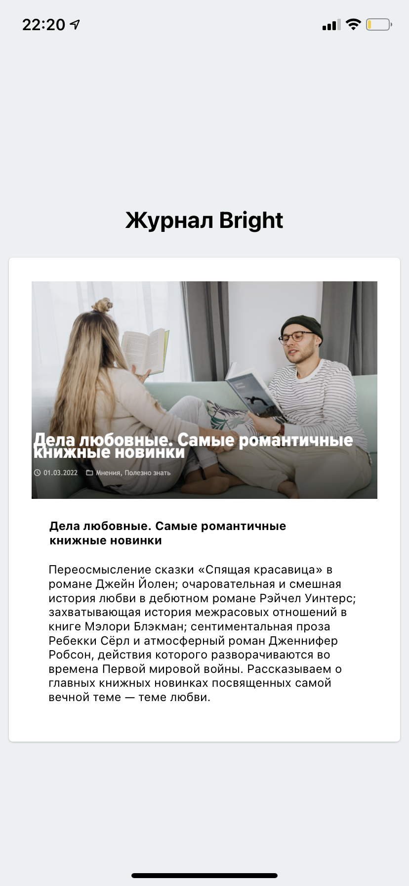

# Стили в React Native

## Цель работы

Получить навыки работы со стилями в React Native.

## Задания для выполнения

Используя стартовый шаблон https://snack.expo.dev/@wed.addams/cd2_1 оформите контент
Контрольные вопросы

## Приведите аналоги тегов html в React Native:
- div - view - разделяет экран
- p - text - разделяет на параграфы
- img - image - вставляет изображения
- button - в "react native" аналогично

# Result

